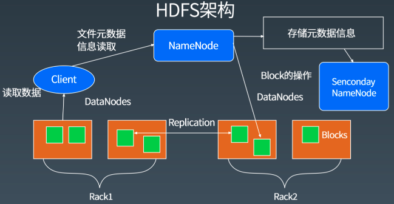
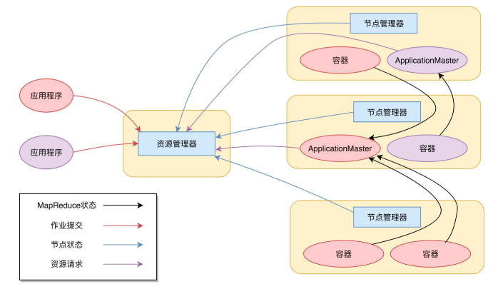
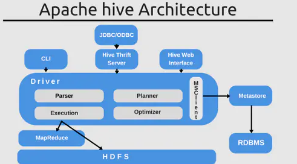

# 第十二周课程笔记

## 大数据应用领域

医学影像智能识别
病历大数据智能诊疗
AI 外语老师
智能解题
舆情监控与分析
大数据风控
新零售
无人驾驶

## HDFS

### HDFS 系统架构

### HDFS 设计目标

- HDFS 以流式数据访问模式存储超大文件，运行于商用硬件集群上。
- 超大文件
- 流式数据访问：一次写入多次读取。
- 商用硬件。

### **不适合 HDFS 的场景**

1. 低延迟的数据访问
2. 大量小文件：超过 NameNode 的处理能力
3. 多用户随机写入修改文件

### Block

Block 块是 HDFS 基本存储单元，Hadoop 1.X 版本是 64MB，2.X 版本是 128MB。每个 Block 都有一个 id，相同的副本保证 id 一致。由于 block 的存储机制，HDFS 比较适合大文件、快速备份。

### NameNode

NameNode 是 HDFS 的核心内容：用于管理 DataNode，记录元数据 Meta。在 1.x 中，最多设置 1 个；在 2.x 以上，最多可以设置 2 个。如果设置两个，不能设置 SecondaryNameNode。

- 元数据

  - 记录切块数量
  - 记录数据库存储位置
  - 记录数据库复本数量
  - 记录文件权限

- 管理 DataNode 流程

  - 心跳机制：DataNode 每隔一段时间，会发生给 NameNode 一条信息，包含当年节点状态， 以及 block 信息
  - 若 NameNode 长时间没有收到 DataNode 的信息，那么就认为 DataNode 信息丢失。默认 10 分钟。
  - 若 DataNode 信息丢失，NameNode 会将 DataNode 的数据再次备份到其他 DataNode，以保证复本数量
  - 安全模式：在启动或者 DataNode 块损坏太多，HDFS 会进入安全模式，安全模式无法进行任何操作

- 复本策略

  客户端不是当前 DataNode，上传数据时，NameNode 选择相对空闲的节点，存放第一个复本；客户端是当前 DataNode，上传数据时，第一个复本为当前节点。第二个复本放在和第一个复本不同机架的节点上。第三个复本放在和第二个复本相同机架的节点上。
   超过三个复本，随机放。

- 机架感知策略

  重要的安全策略，防止同属一个物理机架的服务器宕机，HDFS 会主动分机架存储。这里机架并不是物理结构，而是逻辑结构。通俗一点说，就是一个简单的 ip=>name 的映射。实际使用中，一般会将一个物理机架上的所有节点，放到一个逻辑机架上。

- Secondary NameNode

  Secondary NameNode 与 NameNode 并不是严格意义上的主从关系。仅用来辅助 NameNode 进行元数据合并，不能做到和 NameNode 实时热备。对集群影响不大，能起到一定的备份作用。在 Hadoop2.0 以上，为了 NameNode 的热备，舍弃了 Secondary NameNode。

### DataNode

DataNode 用于存储数据，主要以 block 的形式存储。DataNode 会通过心跳机制发送给 NameNode 信息。

- 读流程

  1. 客户端发送请求到 NameNode 中，NameNode 收到请求后，校验文件存在与否，并将文件的 block 对应的地址(一个 block 对应多个地址)以队列的形式，返回给客户端。
  2. 客户端将各个地址依次取出。从离该客户端较近的地址中取数据。读完一个 block，会依次读取下一个。直到所有 block 都读完。若文件足够大(几 TB)，NameNode 会分几次返回 block。

- 写流程

  客户端发起 RPC 请求到 NameNode，该请求包含对文件信息的描述
   NameNode 收到请求后，检查户是否权限和是否有同名文件。通过文件信息，计算数据块，分配块存储地址。将地址放入队列返回给客户端
   客户端收到地址后，将数据进行封包，写入对应 DataNode 节点上。当写完所有的 block 都放置成功后，客户端通知 NameNode 关流，同时将该文件更改为不可再写。

- 删流程

  客户端发起请求到 NameNode，NameNode 收到请求后，校验文件存在与否和客户端是否有删除权限。将操作记录到 edits_inprogess 中
   删除内存中记录，并返回 ACK 信号，表示删除成功。等待 DataNode 的心跳，如果该 DataNode 存在要删除的数据，则对该节点发送指令进行删除。

## MapReduce

MapReduce 是一种计算模型，该模型可以将大型数据处理任务分解成很多单个的、可以在服务器集群中并行执行的任务，而这些任务的计算结果可以合并在一起来计算最终的结果。

### 大规模数据处理

- 处理海量数据（> 1TB）
- 成百上千 CPU 实现并行处理

简单地实现以上目的：移动计算比移动数据更划算

分而治之（Divide and Conquer）

### MapReduce 特性

- 自动实现分布式并行计算
- 容错
- 提供状态监控工具
- 模型抽象简洁，程序员易用

### MapReduce 的组成程序

MapReduce 由称为 Map 和 Reduce 的两部分用户程序组成，然后利用框架在计算机集群上面根据需求运行多个程序实例来处理各个子任务，然后再对结果进行归并。

## Yarn （Yet Another Resource Negotiator）

MapReduce 2.0 框架就是基于 Yarn的。

不再是一个传统的 MapReduce 框架，甚至于 MapReduce 无关。

MRv2 最基本的设计思想就是将 JobTracker 的两个主要功能，即资源管理和作业管理分成两个独立的进程。

### Yarn架构

Resource Manager：资源管理器。
Node Manager：节点管理器。

资源管理器，从 节点管理器获取容器资源，容器调用ApplicationMaster去处理应用程序。资源管理器可以启动多个不同类型的容器。

Job.jar 分发给ApplicationMaster，ApplicationMaster 启动TaskProcess， 反射加载Job.jar，调用Map方法，或者Reduce方法。

ApplicationMaster 作业完成，释放容器资源。

JobTracker和TaskTracker 是动态启动的。MapReduce 1.0是静态启动的。

**Yarn 包括两个部分：资源管理器（Resource Manager） 和 节点管理器（Node Manager）**

**资源管理器又包括两个主要组件：调度器和应用程序管理器**

### Yarn 的工作流程（MapReduce为例）

1. 我们向 Yarn 提交应用程序，包括 MapReduce ApplicationMaster、我们的MapReduce 程序，以及 MapReduce Application 启动命令。
2. ResourceManger 进程和 NodeManger 进程通信，根据集群资源，为用户程序分配第一个容器，并将 MapReduce ApplicationMaster 分发到这个容器上面，并在容器里面启动 MapReduce ApplicationMaster。
3. MapReduce ApplicationMaster 启动后立即向 ResourceManager 进程注册，并为自己的应用程序申请容器资源。
4. MapReduce ApplicationMaster 申请到需要的容器后，立即和相应的 NodeManger 进程通信，将用户 MapReduce 程序分发到 NodeManger 进程所在的服务器，并在容器中运行，运行的就是 Map 或者 Reduce 任务。
5. Map 或者 Reduce 任务在运行期和 MapReduce ApplicationMaster 通信，汇报自己的运行状态，如果运行结束，MapReduce ApplicationMaster 向 ResourceManager 进程注销并释放所有的容器资源。

## HIVE

Hive 是基于 Hadoop 的一个数据仓库工具，用于计算基于 Hadoop 实现的一个特别的计算模型 MapReduce。它可以将计算任务分割成多个处理单元，然后分散到一群家用或服务器级别的硬件机器上，降低成本并提高水平扩展性。Hive 的数据存储在 Hadoop 一个分布式文件系统上，即 HDFS。

### Hive 工作原理

Hive 的工作原理就是一个查询引擎，和普通的 SQL 执行原理大致相同，分为如下几步：

1. 词法分析： 使用 antlr 将 SQL 语句解析成抽象语法树（AST）
2. 语义分析： 从 Megastore 获取模式信息，验证 SQL 语句中队表名，列名，以及数据类型的检查和隐式转换，以及 Hive 提供的函数和用户自定义的函数（UDF/UAF）
3. 逻辑计划生成，生成逻辑计划——算子树
4. 计划优化：对算子树进行优化，包括列剪枝，分区剪枝，谓词下推等
5. 物理计划生成：将逻辑计划生成包含由 MapReduce 任务组成的 DAG 的物理计划
6. 计划执行：将 DAG 发送到 Hadoop 集群进行执行
7. 最后返回查询结果

## **参考**

大型网站技术架构-李智慧

