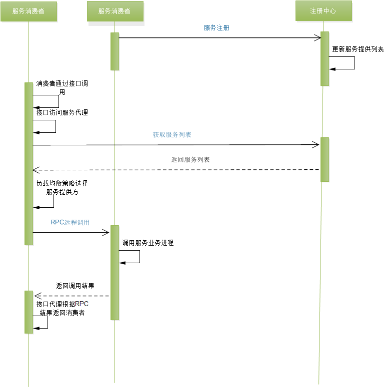

# 第 十周课程作业

### 题目一

根据微服务框架 Dubbo 的架构图，画出 Dubbo 进行一次微服务调用的时序图。

### 题目二

关于微服务架构（中台架构、领域驱动设计、组件设计原则），你有什么样的思考和认识？

在**Robert C. Martin**的 **《架构整洁之道》** 中，他提出了一些用于组件设计的原则，一共包括六个原则。
 **组件聚合**指导我们应该将哪些类组合成一个组件，要考虑三个原则：**复用/发布等同原则**、**共同闭包原则**、**共同复用原则**。
 **组件耦合**帮助我们确定组件之间的相互依赖关系，要考虑三个原则：**无依赖环原则**、**稳定依赖原则**、**稳定抽象原则**。

####  组件聚合

##### 复用/发布等同原则(The Reuse/Release Equivalence Principle, REP)

> 软件复用的最小粒度等同于其发布的最小粒度。

##### 共同闭包原则（The Common Closure Principle, CCP）

> 应该将那些会同时修改、相同目的修改的类放在同一个组件中。另一方面，应该将不会同时修改，不会为了相同的目的而修改的类放在不同的组件中。

##### 共同复用原则（The Common Reuse Principle, CRP）

> 不要强迫一个组件依赖他们不需要的东西。

#### 组件耦合

如何管理组件之间的依赖关系？

##### 无依赖环原则 （Acyclic Dependencies Principle，ADP）

> 组件依赖关系图中不应该出现环

##### 稳定依赖原则（The Stable Dependencies Principle，SDP）

> 依赖关系必须指向更稳定的方向

##### 稳定抽象原则（The Stable Abstractions Principle，SAP）

> 一个组件的抽象化程度应该与其稳定性保持一致。

